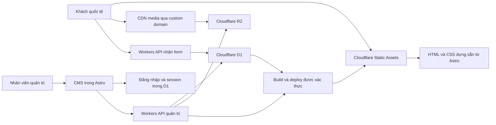

# Melatec — Tech stack và tài liệu bàn giao triển khai

Cập nhật: 10/10/2026 (đổi nguồn Figma; chưa cập nhật UI)

Ngôn ngữ tài liệu: Tiếng Việt  
Mục đích: Cung cấp bối cảnh và định hướng để Claude tiếp tục triển khai website.

## 1. Bối cảnh dự án

Website Melatec giới thiệu dịch vụ nha khoa kết hợp hỗ trợ khách quốc tế đến Việt Nam. Website thiên về nội dung, hình ảnh, thông tin bác sĩ, gói dịch vụ và tiếp nhận yêu cầu tư vấn.

Thiết kế chính do người dùng cung cấp:

- [Figma — Melatec](https://www.figma.com/design/9A1cfRPC1hncD00yh2t1BU/Untitled?node-id=0-1&p=f&t=BhkYqiP9QiBaOoOC-0)
- Tài liệu UI trong workspace: [WEBSITE_STYLE_GUIDE.md](./WEBSITE_STYLE_GUIDE.md).

**Nguồn thiết kế được đổi ngày 10/10/2026 theo yêu cầu chủ dự án.** Link Figma ở trên thay thế nguồn thiết kế cũ cho các thay đổi UI tiếp theo. Đợt này chỉ cập nhật tài liệu; UI hiện tại vẫn theo file cũ, chưa đối chiếu hoặc cập nhật theo file mới.

`WEBSITE_STYLE_GUIDE.md` hiện chưa có trong workspace (xem `CLAUDE.md`). Khi tài liệu này được bổ sung, dùng làm nguồn hỗ trợ; nếu có link Figma cũ hoặc khác biệt thiết kế, đối chiếu với Figma mới ở trên trước khi quyết định.

**Thông tin lịch sử từ Figma cũ, cần kiểm tra lại trên file mới:** cấu trúc đã được đọc gồm các frame About, Services, Dental Implants, Dental Packages / Single Treatments và Dental Packages / Travel Combos, cùng component dùng chung. Các frame đã đọc rộng 1440px. Chưa xác nhận đầy đủ thiết kế mobile, toàn bộ trang và các trạng thái tương tác.

## 2. Yêu cầu đã được người dùng chốt

| Hạng mục                    | Quyết định                                                                        |
| --------------------------- | --------------------------------------------------------------------------------- |
| Frontend                    | **Astro.js**                                                                      |
| Database                    | **Cloudflare D1** (SQLite). Đổi từ Supabase ngày 2026-10-05 theo yêu cầu chủ dự án |
| Hạ tầng website / API / CDN | **Cloudflare**                                                                    |
| Lưu trữ media               | **Cloudflare R2**                                                                 |
| Video streaming             | **Không cần; không tích hợp Cloudflare Stream hoặc xây hệ thống streaming video** |
| CMS                         | **Tự xây để quản lý nội dung website**                                            |
| Payment                     | **Không cần Stripe; không xây thanh toán trong phạm vi hiện tại**                 |
| Hiệu năng                   | **Website phải tải nhanh, phục vụ được traffic quốc tế**                          |
| UI                          | Bám theo file Figma người dùng cung cấp                                           |

Các phần dưới đây là kiến trúc và phạm vi triển khai đề xuất từ trao đổi, không đồng nghĩa mọi chi tiết đã được người dùng phê duyệt riêng.

## 3. Stack triển khai đề xuất

| Thành phần         | Công nghệ                               | Vai trò                                                  |
| ------------------ | --------------------------------------- | -------------------------------------------------------- |
| Website public     | Astro + TypeScript                      | Render HTML, routing, layout và component theo Figma     |
| Styling            | CSS variables / design tokens           | Giữ màu, font, spacing và responsive nhất quán           |
| Hosting            | Cloudflare Workers + Static Assets      | Phục vụ trang dựng sẵn và các route động                 |
| Server API         | Astro server endpoints trên Workers     | Form tư vấn, kiểm tra quyền, upload và thao tác quản trị |
| Database           | Cloudflare D1 (SQLite)                  | Nội dung, cấu hình, media metadata và yêu cầu tư vấn     |
| CMS authentication | Tự xây: PBKDF2 + session trong D1       | Đăng nhập; một vai trò `admin`                           |
| Media storage      | Cloudflare R2                           | Lưu ảnh, tài liệu công khai và file video                |
| Media CDN          | Custom domain của R2 + Cloudflare Cache | Phân phối media cho khách quốc tế                        |
| CMS                | Khu vực `/admin` trong ứng dụng Astro   | Biên tập, preview và xuất bản                            |
| Build / deploy     | Cloudflare Builds hoặc CI tương thích   | Build Astro khi xuất bản và triển khai bản mới           |
| Email thông báo    | Chưa chọn nhà cung cấp                  | Thông báo yêu cầu tư vấn cho nhân viên nếu cần           |

Ưu tiên Workers + Static Assets để thống nhất triển khai. Pages vẫn là phương án hợp lệ cho phần website tĩnh, nhưng không cần dùng đồng thời Pages và Workers nếu không có lý do cụ thể.

Astro có adapter Cloudflare cho route chạy phía server. Kiểm tra tài liệu và phiên bản tương thích khi khởi tạo dự án; không giả định thư viện Node.js nào cũng chạy được trên Workers.

Không cần React cho toàn bộ frontend. Có thể dùng JavaScript nhỏ hoặc island tương tác khi cần. Chỉ thêm framework UI cho editor / thao tác CMS phức tạp nếu có lợi ích rõ ràng.

## 4. Kiến trúc phục vụ website

### Trang public

- Dựng sẵn các trang nội dung bằng Astro ở thời điểm build.
- Lấy nội dung đã xuất bản (snapshot) từ D1 trong quá trình build, qua API Cloudflare.
- Phục vụ HTML từ Cloudflare; không truy vấn database cho mỗi lượt mở trang public.
- Nội dung quan trọng và SEO phải có trong HTML ban đầu.
- Chỉ thêm JavaScript cho tương tác cần thiết.

### Route động

- API nhận yêu cầu tư vấn, xác thực quản trị, preview và thao tác CMS chạy phía server khi cần.
- Cấu hình adapter và các route theo tài liệu Astro của phiên bản đang dùng.
- Các route có dữ liệu cá nhân, preview hoặc yêu cầu đăng nhập không được đưa vào cache công khai.

### Lợi ích cho traffic quốc tế

Cloudflare phân phối static assets và cache trên mạng lưới toàn cầu. Tốc độ đọc trang public không phụ thuộc vào database khi đã dựng sẵn nội dung.

D1 là database tập trung (một primary); Worker có thể ở bất kỳ vị trí nào nên ghi và đọc động có độ trễ đến primary. D1 cho phép gợi ý vị trí khi tạo database (`--location`); chọn theo vị trí đội vận hành, vì phần động chủ yếu là `/admin`. Chưa chốt region cụ thể.

## 5. Quy trình nội dung và xuất bản CMS

Luồng đề xuất:

1. Nhân viên đăng nhập CMS.
2. Chỉnh nội dung và lưu draft.
3. Preview bằng route được bảo vệ, không index trên công cụ tìm kiếm.
4. Bấm Publish để tạo phiên bản nội dung xuất bản rõ ràng.
5. Backend kích hoạt build qua cơ chế được xác thực; không chạy build nặng trực tiếp trong request Worker.
6. Build Astro chỉ đọc nội dung được chọn cho lần xuất bản đó.
7. Khi build và deploy thành công, website public chuyển sang bản mới.
8. CMS hiển thị trạng thái và thời điểm bản đó đã được triển khai.

Các trạng thái nên có: `draft`, `queued`, `building`, `deployed`, `failed`.

Yêu cầu thiết kế dữ liệu:

- Draft không được làm thay đổi nội dung public trước khi xuất bản.
- Phân biệt nội dung đã được duyệt xuất bản và nội dung đã thực sự deploy.
- Dùng revision hoặc snapshot để build không đọc dữ liệu đang được chỉnh sửa dở.
- Nếu build thất bại, tiếp tục phục vụ bản deploy thành công trước đó.
- Gộp hoặc xếp hàng các lần Publish gần nhau để tránh build chồng chéo.
- Không đưa secret build hook ra trình duyệt.

Đánh đổi: cập nhật CMS phải chờ build / deploy trước khi xuất hiện trên trang public. Nếu phát sinh yêu cầu cập nhật tức thời, đánh giá SSR và cache cho những route cụ thể thay vì chuyển toàn bộ website sang render động.

## 6. Phạm vi CMS đề xuất

| Module           | Nội dung                                                                   |
| ---------------- | -------------------------------------------------------------------------- |
| Trang và section | Hero, tiêu đề, mô tả, CTA, thứ tự và bật/tắt section                       |
| Dịch vụ          | Mô tả, ảnh, nội dung chi tiết, liên kết và FAQ                             |
| Bác sĩ           | Tên, ảnh, chuyên môn, hồ sơ và dịch vụ liên quan                           |
| Gói nha khoa     | Hạng mục bao gồm, giá tham khảo, tiền tệ và điều kiện                      |
| Travel Guide     | Bài viết, điểm đến và thông tin hỗ trợ khách quốc tế                       |
| FAQ              | Câu hỏi, câu trả lời, nhóm và thứ tự                                       |
| Media            | Upload, chọn ảnh/video, alt text, poster và metadata                       |
| SEO              | Slug, title, description, ảnh chia sẻ và redirect khi đổi slug             |
| Cấu hình website | Menu, footer, thông tin liên hệ và mạng xã hội                             |
| Xuất bản         | Draft, preview, publish và lịch sử phiên bản                               |
| Yêu cầu tư vấn   | Danh sách, chi tiết và trạng thái xử lý; quyền riêng với biên tập nội dung |

Layout được xây bằng component Astro theo Figma. CMS chỉnh nội dung và các tùy chọn bố cục có giới hạn. Không mặc định xây page builder kéo thả tự do.

Các vai trò ban đầu đề xuất là `admin` và `editor`. Quyền xử lý yêu cầu tư vấn có thể tách riêng nếu đội vận hành cần.

## 7. Mô hình dữ liệu tham khảo

Tên bảng chỉ là gợi ý để lập schema, không phải schema đã được triển khai:

- `pages`, `page_sections`: trang và cấu trúc nội dung.
- `services`, `doctors`, `doctor_services`: dịch vụ, bác sĩ và quan hệ giữa chúng.
- `packages`, `package_items`: gói dịch vụ và hạng mục.
- `articles`, `destinations`, `faqs`: nội dung bài viết và hỗ trợ du lịch.
- `media_assets`: object key R2, loại file, kích thước, alt text, poster và trạng thái.
- `site_settings`, `navigation_items`: cấu hình chung.
- `content_revisions`, `publish_jobs`: phiên bản nội dung và tiến trình xuất bản.
- `consultation_requests`: yêu cầu tư vấn.
- `admin_roles`, `audit_logs`: phân quyền và lịch sử thao tác.

Dùng bảng quan hệ cho các thực thể có cấu trúc. Có thể dùng JSONB cho nội dung section có schema rõ ràng; cần validation và version schema. Tránh dồn toàn bộ website vào một JSON không kiểm soát.

Chưa có yêu cầu tài khoản khách hàng, booking theo slot thời gian, thanh toán hoặc lưu hồ sơ bệnh án. Không tự mở rộng sang các chức năng đó.

## 8. Media, ảnh và video

### Ảnh

- R2 lưu file; D1 lưu metadata và quan hệ với nội dung.
- Dùng custom domain cho media, ví dụ `media.<domain>`; đây là ví dụ, chưa có domain thật.
- Cấu hình Cloudflare Cache và cache headers phù hợp.
- Tạo biến thể ảnh theo kích thước sử dụng; ưu tiên WebP/AVIF với fallback phù hợp.
- R2 không tự tạo biến thể ảnh: cần pipeline lúc upload/build hoặc dịch vụ xử lý ảnh phù hợp.
- Dùng `srcset` / `sizes`, khai báo kích thước để giảm xê dịch bố cục.
- Ảnh hero ưu tiên tải; ảnh phía dưới lazy-load.
- Khi thay file, ưu tiên object key có phiên bản để tránh cache ảnh cũ.

### Video

- Nếu website có video giới thiệu: lưu file MP4 đã tối ưu trên R2, hiển thị poster trước, tải khi cần xem bằng trình phát HTML5.
- Không tải toàn bộ video ngay khi mở trang nếu không có yêu cầu cụ thể.
- Không triển khai livestream, adaptive streaming, HLS/DASH hoặc pipeline transcoding video.
- Chưa xác nhận số lượng, dung lượng và thời lượng file video giới thiệu; không tự bổ sung chức năng video ngoài thiết kế.

## 9. Form tư vấn

Luồng đề xuất: khách gửi form → Workers API kiểm tra dữ liệu → lưu D1 → theo dõi trong admin (đã chốt: không gửi email).

- Chỉ yêu cầu thông tin thực sự cần cho tư vấn; đối chiếu field với Figma.
- Validation phía server, giới hạn kích thước request và chống gửi trùng ngoài ý muốn.
- Có trạng thái loading, thành công, lỗi và retry rõ ràng.
- Chống spam bằng rate limiting và cơ chế phù hợp như Turnstile khi cần.
- Lưu yêu cầu thành công trước; lỗi gửi email không được làm mất yêu cầu đã nhận.
- Nếu thông báo email thất bại, ghi nhận và có cơ chế thử lại.

MVP chưa mặc định nhận ảnh chẩn đoán hay hồ sơ bệnh nhân. Nếu bổ sung, phải thiết kế upload riêng tư và kiểm tra quyền truy cập, tách khỏi media public.

## 10. Hiệu năng và nghiệm thu quốc tế

### Mục tiêu

| Chỉ số | Mục tiêu   |
| ------ | ---------- |
| LCP    | ≤ 2,5 giây |
| INP    | ≤ 200 ms   |
| CLS    | ≤ 0,1      |

Đây là mục tiêu Core Web Vitals, không phải kết quả đã đo. Sau khi có traffic, đánh giá ở phân vị 75 của lượt truy cập thực tế, riêng mobile và desktop.

### Nguyên tắc triển khai

- Trang public dựng sẵn, nội dung chính không phụ thuộc fetch từ browser.
- JavaScript tối thiểu; CMS/editor không được làm tăng bundle của trang public.
- Font WOFF2, chỉ tải family / weight cần dùng; giữ đúng font trong thiết kế.
- Tối ưu ảnh hero và gallery trước khi tăng các hiệu ứng.
- Dùng cache dài cho asset có tên phiên bản; có chiến lược cập nhật HTML khi deploy.
- Chat widget, bản đồ, video embed và script bên thứ ba tải sau khi cần hoặc sau nội dung chính.
- Không cache công khai dữ liệu quản trị hoặc yêu cầu tư vấn.

### Cách kiểm chứng

- Đo các trang đại diện: Home, dịch vụ, gói nha khoa và bài viết.
- Kiểm tra trên mobile, mạng bị giới hạn và desktop.
- Đo từ các thị trường mục tiêu; tạm đề xuất Mỹ, châu Âu, Úc, Singapore và Việt Nam, chưa xác nhận ưu tiên kinh doanh.
- So sánh cache miss và cache hit; không dùng kết quả cache hit duy nhất để cam kết tốc độ.
- Dùng Lighthouse / PageSpeed cho kiểm tra trong lab, kết hợp dữ liệu người dùng thực tế khi có traffic.
- Thử tải riêng static assets và API form; kiểm tra quota, giới hạn và hành vi khi traffic tăng.

Cloudflare hỗ trợ phân phối toàn cầu, nhưng không bảo đảm một thời gian tải cố định cho mọi quốc gia, thiết bị hoặc nhà mạng. Traffic hiện tại và dự kiến chưa được cung cấp.

## 11. UI, responsive và SEO

- Đọc Figma và `WEBSITE_STYLE_GUIDE.md` trước khi xây component.
- Dùng lại header, footer, button, card và form; giữ design tokens tập trung.
- Giữ ảnh, nội dung và thông tin có nguồn; không tự tạo giá, chứng nhận, đánh giá hoặc thành tích bác sĩ.
- Bổ sung responsive mobile/tablet và các trạng thái tương tác nếu Figma chưa có.
- Kiểm tra trang dài, nội dung nhiều dòng, crop ảnh và thao tác bàn phím.
- Title / description riêng cho mỗi trang, canonical, sitemap, robots và URL rõ ràng.
- Preview và admin không index; `noindex` không thay thế xác thực.
- Chưa chốt đa ngôn ngữ. Cấu trúc hiện có nhiều nội dung tiếng Anh; đối chiếu với chủ dự án trước khi thêm ngôn ngữ.

## 12. Quyền truy cập, môi trường và vận hành

- D1 không có API công khai và không có RLS: chỉ Worker (binding) và CI (token Cloudflare) vào được, nên mọi quyền do mã kiểm. Middleware xác thực mọi request `/admin/*`.
- Token API Cloudflare có quyền D1 chỉ ở backend / CI secret.
- Không tin role do client tự khai báo; không cho người dùng tự nâng quyền.
- Giữ token Cloudflare, R2 credentials và build hook trong secret của runtime/CI; không commit vào repository.
- Tách cấu hình local, staging và production; không mặc định cho staging ghi dữ liệu production.
- Quản lý schema bằng migration được lưu trong repo.
- Backup database: D1 Time Travel (7 ngày ở Free, 30 ngày ở Paid) và `wrangler d1 export`; backup DB không thay thế backup R2.
- Log lỗi và publish jobs, hạn chế ghi thông tin cá nhân vào log.
- Chọn nhà cung cấp email và cấu hình domain gửi thư khi triển khai thông báo.

## 13. Chi phí tham khảo

Mức giá đã kiểm tra trong trao đổi ngày 04/10/2026; cần kiểm tra lại khi triển khai:

### Phương án bắt đầu miễn phí

Có thể bắt đầu với **0 USD/tháng cho hosting, database và media** khi nằm trong quota. Đây là lựa chọn đề xuất cho development/MVP, chưa phải yêu cầu bắt buộc chỉ dùng gói miễn phí.

| Thành phần                     | Hạn mức miễn phí tham khảo                                                                                            |
| ------------------------------ | --------------------------------------------------------------------------------------------------------------------- |
| Cloudflare Static Assets       | Request phục vụ trực tiếp static assets miễn phí, không giới hạn số request theo bảng giá                             |
| Workers Free                   | 100.000 request động/ngày; 10 ms CPU cho mỗi request HTTP                                                             |
| Cloudflare Workers Builds Free | 3.000 phút build/tháng; một build chạy đồng thời                                                                      |
| D1 Free                        | 5 GB tổng dung lượng, tối đa 500 MB/database, 10 database, 5 triệu dòng đọc/ngày, 100.000 dòng ghi/ngày               |
| R2 Standard free tier          | 10 GB-month lưu trữ, 1 triệu thao tác Class A và 10 triệu thao tác Class B mỗi tháng; egress trực tiếp từ R2 miễn phí |

Điều kiện và đánh đổi:

- Static assets phải được phục vụ trực tiếp, tránh cho mọi lượt xem trang đi qua Worker để không tiêu quota API không cần thiết.
- Kiểm tra CPU thực tế của route SSR/CMS/API: 10 ms là thời gian xử lý CPU, không phải tổng thời gian chờ mạng. Có thể cần Workers Paid trước khi vượt số request nếu xử lý quá nặng.
- D1 không bị pause khi không hoạt động. Hết quota ngày thì truy vấn bị từ chối đến hôm sau (không tính phí vượt ở Free).
- **Đăng nhập admin tốn CPU** (băm mật khẩu PBKDF2 100.000 vòng). Workers Free giới hạn 10 ms CPU mỗi request: cần thử đăng nhập trên staging; nếu bị cắt, chuyển Workers Paid hoặc hạ số vòng băm (kém an toàn hơn).
- Time Travel ở Free chỉ 7 ngày; xuất `consultation_requests` định kỳ vì không dựng lại được.
- R2 cần kích hoạt subscription qua checkout; dùng vượt quota sẽ phát sinh phí. Free tier không phải cơ chế hard cap chi tiêu.
- Theo dõi storage, thao tác R2 và build minutes; gộp các lần Publish gần nhau để tiết kiệm build.
- Dùng subdomain `workers.dev` để thử nghiệm không cần mua domain. Domain riêng vẫn có phí đăng ký/gia hạn nếu chưa sở hữu; media R2 qua custom domain cần domain của mình.
- Chưa tính phí domain, dịch vụ email, công phát triển hoặc subscription công cụ AI.
- Không có chi phí dịch vụ streaming video trong stack. Có thể tạo biến thể ảnh lúc upload/build để tránh dịch vụ xử lý ảnh trả phí ở bản đầu.

Nguồn: [Workers pricing](https://developers.cloudflare.com/workers/platform/pricing/), [Workers limits](https://developers.cloudflare.com/workers/platform/limits/), [Builds limits](https://developers.cloudflare.com/workers/ci-cd/builds/limits-and-pricing/), [D1 pricing](https://developers.cloudflare.com/d1/platform/pricing/), [D1 limits](https://developers.cloudflare.com/d1/platform/limits/), [R2 pricing](https://developers.cloudflare.com/r2/pricing/), [R2 setup](https://developers.cloudflare.com/r2/get-started/).

### Phương án nâng cấp trả phí

| Dịch vụ                 | Tham khảo                                                                                     |
| ----------------------- | --------------------------------------------------------------------------------------------- |
| Cloudflare Workers Paid | Tối thiểu 5 USD/tháng, cộng sử dụng vượt quota; gồm D1 (25 tỷ dòng đọc, 50 triệu dòng ghi, 5 GB mỗi tháng) |
| R2 Standard             | 0,015 USD/GB/tháng cộng phí thao tác; có quota miễn phí, không thu phí egress trực tiếp từ R2 |

Nếu nâng cấp Workers Paid, mức nền tảng cơ bản khoảng 5 USD/tháng (D1 nằm trong gói này) cộng media và dịch vụ phụ trợ. Đây không phải chi phí tối thiểu bắt buộc. Ước tính chưa gồm domain, email, staging, xử lý ảnh/video, giám sát trả phí, thuế và chi phí phát triển.

## 14. Thứ tự triển khai đề xuất

1. Đối chiếu toàn bộ trang Figma, nội dung và thiết kế mobile còn thiếu.
2. Khởi tạo Astro + TypeScript và cấu hình Cloudflare phù hợp.
3. Xây tokens, layout và component dùng chung.
4. Triển khai UI public với nội dung mẫu lấy từ nguồn được cung cấp.
5. Thiết kế schema D1, migrations và đăng nhập admin.
6. Xây CMS, quản lý media R2 và preview.
7. Xây quy trình draft → publish → build → deploy.
8. Kết nối form tư vấn và thông báo nếu đã chọn email.
9. Kiểm tra giao diện, quyền truy cập, xuất bản, SEO và hiệu năng quốc tế.

## 15. Những thông tin còn cần xác định

- Danh sách trang đầy đủ và Figma Home / mobile chính thức nếu chưa nằm trong file.
- Domain, tài khoản Cloudflare và quyền triển khai (D1 `melatec` và `melatec-staging` chưa tạo).
- Region database và thị trường quốc tế ưu tiên.
- Số lượng ngôn ngữ.
- Các vai trò CMS và ai được quyền Publish.
- Nhà cung cấp email và địa chỉ nhận thông báo.
- Số lượng/dung lượng video; nhu cầu cập nhật nội dung tức thời.
- Traffic dự kiến và ngân sách vận hành.

Các thông tin thiếu không ngăn việc triển khai UI và thiết kế kiến trúc. Dùng placeholder rõ ràng cho cấu hình chưa có, không tự tạo thông tin kinh doanh.

## 16. Hướng dẫn dành cho Claude

Hãy dùng tài liệu này làm bối cảnh triển khai, giữ các quyết định đã chốt ở mục 2. Trước khi viết code, đọc hướng dẫn repository nếu có, kiểm tra hiện trạng workspace, đọc style guide và đối chiếu Figma chính.

Ưu tiên Astro dựng sẵn trang public, Cloudflare phân phối toàn cầu, D1 phục vụ CMS/form và R2 lưu media. Giữ nội dung công khai độc lập với database ở mỗi lượt xem trang. Thiết kế CMS theo component và trường nội dung có cấu trúc.

Không thêm Stripe, checkout, dịch vụ streaming video, tài khoản khách hàng hoặc hệ thống bệnh án vào phạm vi hiện tại. Video giới thiệu nếu có chỉ được phục vụ dưới dạng file từ R2. Các chi tiết còn là đề xuất cần được đánh giá theo code và yêu cầu thực tế. Pin phiên bản sau khi kiểm tra tương thích; không sao chép cấu hình runtime cũ một cách máy móc.

## 17. Tài liệu kỹ thuật chính thức

- [Astro Islands Architecture](https://docs.astro.build/en/concepts/islands/)
- [Astro Rendering](https://docs.astro.build/en/guides/on-demand-rendering/)
- [Astro deployment trên Cloudflare](https://docs.astro.build/en/guides/deploy/cloudflare/)
- [Cloudflare Workers Static Assets](https://developers.cloudflare.com/workers/static-assets/)
- [R2 public buckets, custom domains và cache](https://developers.cloudflare.com/r2/buckets/public-buckets/)
- [Cloudflare D1](https://developers.cloudflare.com/d1/)
- [Core Web Vitals](https://web.dev/articles/vitals)
- [D1 pricing](https://developers.cloudflare.com/d1/platform/pricing/)
- [Workers pricing](https://developers.cloudflare.com/workers/platform/pricing/)
- [R2 pricing](https://developers.cloudflare.com/r2/pricing/)
